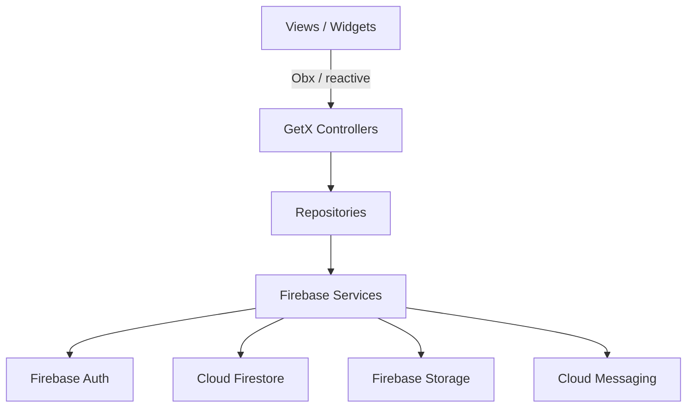

# Signara Collar — Firebase Backend Full Roadmap

## App Overview

Signara Collar is a smart dog collar management app. Users register, add their dogs, pair a smart collar device, run training/monitoring sessions (live sensor data), and view session summaries and history.

---

## Firebase Services Required

- **Firebase Auth** — email/password login + phone OTP
- **Cloud Firestore** — all database data
- **Firebase Storage** — dog/user profile photos
- **Firebase Cloud Messaging (FCM)** — push notifications
- **Firebase Cloud Functions** — backend logic (session analytics, alerts)
- **Firebase Analytics** — usage tracking

---

## Firestore Database Schema (All Collections)

### `users/{userId}`

```
{
  uid: string,
  email: string,
  displayName: string,
  phoneNumber: string,
  avatarUrl: string,         // Firebase Storage URL
  createdAt: Timestamp,
  updatedAt: Timestamp,
  fcmToken: string,          // for push notifications
  isOnboardingComplete: bool
}
```

### `users/{userId}/dogs/{dogId}`

```
{
  dogId: string,
  name: string,
  breed: string,
  age: number,               // in months
  weight: number,            // in kg
  gender: string,            // 'male' | 'female'
  photoUrl: string,          // Firebase Storage URL
  microchipId: string,
  vaccinationDate: Timestamp,
  healthNotes: string,
  createdAt: Timestamp,
  updatedAt: Timestamp
}
```

### `devices/{deviceId}`

```
{
  deviceId: string,
  deviceLabel: string,       // collar name
  ownerId: string,           // userId
  dogId: string,             // linked dog
  macAddress: string,
  firmwareVersion: string,
  batteryLevel: number,
  isActive: bool,
  lastSeen: Timestamp,
  pairedAt: Timestamp
}
```

### `sessions/{sessionId}`

```
{
  sessionId: string,
  userId: string,
  dogId: string,
  deviceId: string,
  moduleType: string,        // 'training' | 'health' | 'play' | 'walk'
  status: string,            // 'active' | 'completed' | 'cancelled'
  startTime: Timestamp,
  endTime: Timestamp,
  durationSeconds: number,
  
  // Questionnaire answers (from session_live_view)
  userRating: number,        // 1-5 slider
  energyLevel: number,       // 1-5 slider
  moodBefore: string,
  moodAfter: string,
  notes: string,
  
  // Aggregated sensor summary
  avgHeartRate: number,
  maxHeartRate: number,
  avgTemperature: number,
  stepCount: number,
  caloriesBurned: number,
  
  createdAt: Timestamp
}
```

### `sessions/{sessionId}/sensor_data/{dataId}`

```
{
  timestamp: Timestamp,
  heartRate: number,
  temperature: number,
  accelerometerX: number,
  accelerometerY: number,
  accelerometerZ: number,
  steps: number,
  gpsLat: number,
  gpsLng: number
}
```

### `modules/{moduleId}`

```
{
  moduleId: string,
  name: string,              // 'Basic Training', 'Health Check', 'Play Mode'
  description: string,
  iconUrl: string,
  durationMinutes: number,   // suggested duration
  isActive: bool,
  order: number              // display order
}
```

### `notifications/{notificationId}`

```
{
  notificationId: string,
  userId: string,
  title: string,
  body: string,
  type: string,              // 'session_reminder' | 'health_alert' | 'device_low_battery'
  isRead: bool,
  data: Map<string, dynamic>, // extra payload
  createdAt: Timestamp
}
```

---

## Current Files to Modify

- `[lib/data/remote/firebase_service.dart](lib/data/remote/firebase_service.dart)` — enable real `Firebase.initializeApp`
- `[pubspec.yaml](pubspec.yaml)` — uncomment `firebase_core`, add new Firebase packages
- `[lib/app/bindings/auth_binding.dart](lib/app/bindings/auth_binding.dart)` — register `AuthController`
- `[lib/app/bindings/dashboard_binding.dart](lib/app/bindings/dashboard_binding.dart)` — register `DashboardController`
- `[lib/ui/controllers/add_dog_controller.dart](lib/ui/controllers/add_dog_controller.dart)` — wire real Firestore save
- All auth views — wire to real Firebase Auth

---

## New Files to Create

### Models

- `lib/data/models/user_model.dart`
- `lib/data/models/dog_model.dart`
- `lib/data/models/device_model.dart`
- `lib/data/models/session_model.dart`
- `lib/data/models/session_sensor_data.dart`
- `lib/data/models/module_model.dart`
- `lib/data/models/notification_model.dart`

### Repositories

- `lib/data/repositories/auth_repository.dart`
- `lib/data/repositories/dog_repository.dart`
- `lib/data/repositories/device_repository.dart`
- `lib/data/repositories/session_repository.dart`
- `lib/data/repositories/notification_repository.dart`Controllers

- `lib/ui/controllers/auth_controller.dart`
- `lib/ui/controllers/dashboard_controller.dart`
- `lib/ui/controllers/session_live_controller.dart`
- `lib/ui/controllers/session_summary_controller.dart`
- `lib/ui/controllers/device_controller.dart`
- `lib/ui/controllers/notification_controller.dart`

### Services

- `lib/data/remote/auth_service.dart`
- `lib/data/remote/storage_service.dart`
- `lib/data/remote/fcm_service.dart`

---

## Phased Feature Roadmap

### Phase 1 — Firebase Foundation

- Run `flutterfire configure` to generate `firebase_options.dart`
- Add `google-services.json` (Android) and `GoogleService-Info.plist` (iOS)
- Add packages: `firebase_auth`, `cloud_firestore`, `firebase_storage`, `firebase_messaging`
- Enable `FirebaseService.initialize()` properly
- Set up Firestore security rules

### Phase 2 — Authentication (Real)

- `AuthController` with Firebase Auth
- Login with email/password (wire `LoginView`)
- Password reset via email link (wire `ForgotPasswordView`)
- OTP verification via Firebase Phone Auth (wire `VerifyCodeView`)
- Set new password (wire `CreatePasswordView`)
- Save user profile to `users/{uid}` on first sign-in
- Persist auth state — redirect to `/home` if already logged in, else `/login`

### Phase 3 — Dog Management (Real CRUD)

- `DogRepository` with Firestore CRUD
- `AddDogController` saves to `users/{uid}/dogs/{dogId}`
- Upload dog photo to `Firebase Storage` → save URL
- `DashboardController` fetches dog list from Firestore
- Edit + delete dog profile

### Phase 4 — Device (Collar) Pairing

- `DeviceController` to pair/unpair collar
- Store device in `devices/{deviceId}`
- Link device to a dog
- Show device battery level and last-seen time on dashboard

### Phase 5 — Session Management (Real)

- `SessionLiveController` — start session, write to `sessions/{id}`
- Stream sensor data to `sessions/{id}/sensor_data/` in real-time
- End session — calculate summary stats, update session doc
- `SessionSummaryController` — read from Firestore
- Session history list on dashboard (ordered by `startTime` desc)

### Phase 6 — Push Notifications

- `FCMService` setup with `firebase_messaging`
- Save `fcmToken` to user document on login
- Send alerts: low battery, session reminder, health alert
- In-app notification center (reads `notifications/{id}`)

### Phase 7 — Analytics & Insights

- Per-dog health trend charts (heart rate, steps, calories over time)
- Session frequency & duration history
- Weekly/monthly progress summary
- Cloud Functions for computing aggregated stats

### Phase 8 — Advanced Features

- Multi-dog support (switch between dogs on dashboard)
- Vet access sharing (share dog data with vet via email invite)
- Export session data (PDF/CSV)
- Offline support via Firestore `persistenceEnabled`

---

## Architecture Flow




---

## Firestore Security Rules (Basic)

```
rules_version = '2';
service cloud.firestore {
  match /databases/{database}/documents {
    match /users/{userId} {
      allow read, write: if request.auth.uid == userId;
      match /dogs/{dogId} {
        allow read, write: if request.auth.uid == userId;
      }
    }
    match /sessions/{sessionId} {
      allow read, write: if request.auth.uid == resource.data.userId;
    }
    match /devices/{deviceId} {
      allow read, write: if request.auth.uid == resource.data.ownerId;
    }
    match /modules/{moduleId} {
      allow read: if request.auth != null;
    }
    match /notifications/{notificationId} {
      allow read, write: if request.auth.uid == resource.data.userId;
    }
  }
}
```

